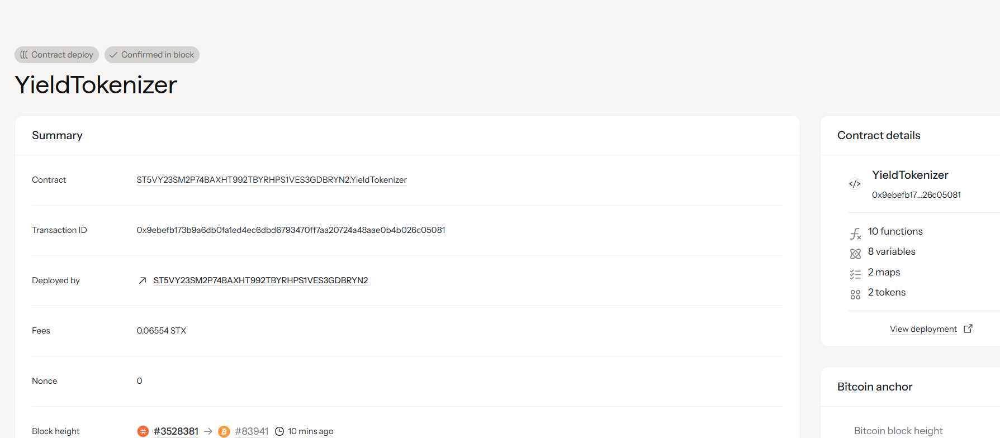

# Yield Tokenizer

## Project Description

The Yield Tokenizer is a revolutionary DeFi protocol built on the Stacks blockchain that separates yield from principal, enabling users to trade future yield streams as separate, liquid tokens. This innovative approach unlocks new financial primitives by allowing the discrete trading of yield-bearing assets and their expected returns.

The protocol works by taking a user's principal deposit and splitting it into two distinct tokens:
- **Principal Tokens**: Represent the original deposited amount, redeemable at maturity
- **Yield Tokens**: Represent the rights to future yield generated by the principal

This separation creates a liquid market for both the underlying asset and its expected returns, enabling sophisticated yield trading strategies, hedging mechanisms, and enhanced capital efficiency.

## Project Vision

Our vision is to democratize access to sophisticated yield trading strategies traditionally available only to institutional investors. By tokenizing future yield streams, we aim to:

- **Enhance Capital Efficiency**: Allow users to monetize future yields immediately rather than waiting for maturity
- **Create New Market Dynamics**: Enable price discovery for future yield expectations across different time horizons
- **Reduce Risk Exposure**: Provide tools for users to hedge against yield volatility and interest rate changes
- **Improve Liquidity**: Transform illiquid yield-bearing positions into tradeable, liquid tokens
- **Foster Innovation**: Serve as infrastructure for next-generation DeFi products and yield optimization strategies

We envision a future where yield can be as easily traded as any other financial asset, creating more efficient markets and better risk management tools for all participants.

## Future Scope

The Yield Tokenizer protocol has extensive potential for expansion and enhancement:

### Phase 1 (Current Implementation)
- Basic yield tokenization with STX collateral
- Principal and yield token separation
- Simple maturity-based redemption mechanism

### Phase 2 (Short-term Roadmap)
- **Multi-Asset Support**: Extend beyond STX to support SIP-010 tokens, Bitcoin, and other assets
- **Automated Market Makers**: Integrate with DEXs to provide automated liquidity for principal and yield tokens
- **Yield Aggregation**: Connect with external yield-generating protocols (staking, lending, liquidity provision)
- **Advanced Pricing Models**: Implement sophisticated yield curve modeling and dynamic pricing

### Phase 3 (Medium-term Expansion)
- **Cross-Chain Integration**: Bridge to other blockchains for expanded asset support
- **Institutional Features**: Add features for large-scale institutional yield management
- **Derivatives Layer**: Enable options and futures on yield tokens
- **Governance Token**: Launch protocol governance with community-driven development

### Phase 4 (Long-term Vision)
- **AI-Powered Yield Optimization**: Machine learning algorithms for optimal yield strategies
- **Regulatory Compliance Tools**: Features for institutional compliance and reporting
- **Global Yield Marketplace**: Comprehensive platform for all types of yield trading
- **Educational Ecosystem**: Tools and resources for yield strategy education

### Technical Enhancements
- **Gas Optimization**: Reduce transaction costs through efficient contract design
- **Security Audits**: Regular third-party security reviews and formal verification
- **Scalability Solutions**: Layer 2 integration for high-frequency yield trading
- **User Experience**: Intuitive interfaces for both retail and institutional users

### Integration Opportunities
- **DeFi Protocols**: Native integration with lending platforms, staking services, and yield farms
- **Portfolio Management**: Tools for automated yield strategy execution
- **Risk Management**: Advanced hedging and insurance products
- **Analytics Platform**: Comprehensive yield analytics and market intelligence

## Contract Address Details

**Contract Address**: [To be deployed]

**Network**: Stacks Mainnet

**Token Standards**: 
- Principal Tokens: SIP-010 Fungible Token Standard
- Yield Tokens: SIP-010 Fungible Token Standard

**Key Functions**:
- `tokenize-yield`: Separates principal and yield into tradeable tokens
- `redeem-yield`: Allows yield token holders to claim their portion of generated yield

**Deployment Information**:
- Deployer: [Contract Owner Address]
- Deployment Block: [Block Number]
- Transaction ID: [Deployment TX ID]

**Verification**:
- Source Code: Available on GitHub
- Audit Status: [Pending/Completed]
- Security Contact: [Security Email]

---

## 📦 Smart Contract Address
ST5VY23SM2P74BAXHT992TBYRHPS1VES3GDBRYN2.YieldTokenizer

---
